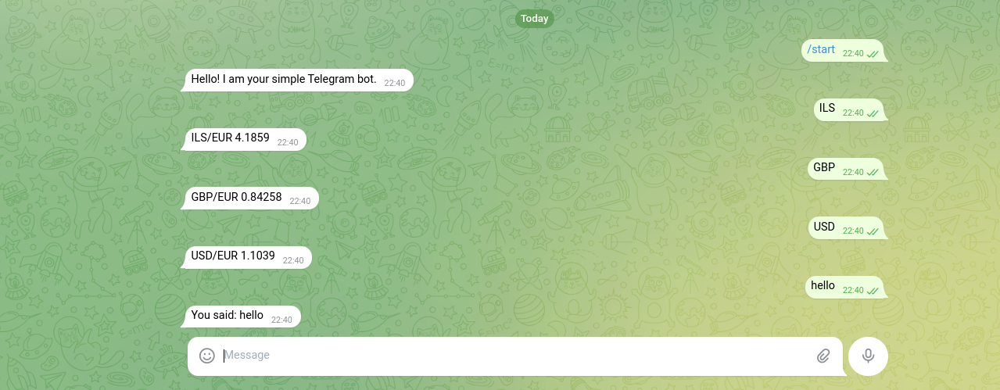

# naya_p1

Firts project Naya course.

Telegram bot
Flask web server

The code [api.py] fetch latest foregn currency dataset(csv)     
from `https://www.ecb.europa.eu/stats/eurofxref/eurofxref-hist.zip` and from 
`https://www.ecb.europa.eu/stats/eurofxref/eurofxref.zip` load it to pandas and present results in Flask based web application and Telegram bot

Telegram bot screenshot:

Flask app available on

code:

`@app.route('/')
def home():
    return render_template('index.html', x=x, y=y)
@app.route('/rates')
def rates():
    return render_template('my_file.html', 
                           z = z.get('Date'), 
                           usd = z.get(' USD'), 
                           gbp = z.get(' GBP'), 
                           ils = z.get(' ILS')
                           )`

or 

